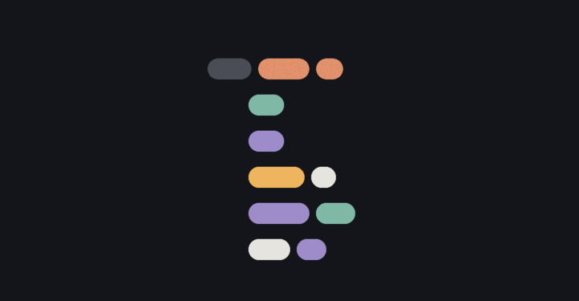

<p align="center">
  
</p>

# Tabbo

Typesetter for lute tablature, supporting renaissance and baroque lutes in French and Italian notation. Works like TeX - processes plain text `.tab` files into typeset, print-ready scores, with a live preview as you type.

## Alpha

An early alpha - expect rough edges. Found something broken? [Open an issue](https://github.com/samrobn/tabbo/issues). The [latest release](https://github.com/samrobn/tabbo/releases/latest) is always the current build.

### Install

1. Download `stable-macos-arm64-Tabbo.dmg` from the [latest release](https://github.com/samrobn/tabbo/releases/latest).
2. Open the `.dmg` and drag Tabbo to Applications.

Releases are signed and notarised, so the app opens without Gatekeeper workarounds. Updates land in-app: the update modal appears when a new release is available, downloads in the background, and restarts to apply.

### Editing and preview

- Tabbo opens on a welcome screen when no file is loaded - start a new document, open one, or pick a template. Your last-opened file reopens automatically next launch.
- The editor highlights `.tab` syntax and rules a faint line at each barline; the preview typesets the full document live as you type.
- Multi-page scores render every page in the preview, and the editor and preview scroll in sync (toggleable from the preview's zoom cluster).
- `Cmd+F` opens find; compile errors surface at the top of the preview with line numbers.

### Saving and exporting

- Click the filename (the chevron button at the top-left of the editor) to open the document menu: rename the file and choose which folder it saves to. Both apply on the next save.
- `Cmd+S` saves - silently on success (the **Edited** badge clears). A file you opened is saved back in place; a new document defaults to `~/Documents/Tabbo/`. Saving into a folder that already holds a file of that name asks before replacing it.
- `Cmd+Shift+E` exports a PDF to the same folder and shows a "Saved to ..." toast; re-exporting with the same name overwrites it.
- Save and export errors show a red toast at the top of the preview pane.

### Unsaved changes

- A muted **Edited** badge appears next to the filename when there are unsaved changes, and fades out when you save.
- Opening another file, starting a new one, or loading a template prompts before discarding edits.
- **File → Close** (`Cmd+W`) closes the current document back to the welcome screen, prompting first if there are unsaved changes.
- `Cmd+Q` and closing the window prompt to Save, Discard, or Cancel when there are unsaved changes. The buffer is also autosaved every 30 seconds and on focus loss, so a force-quit still restores your work on relaunch.

## Project structure

Tabbo is an [Electrobun](https://blackboard.sh/electrobun/) desktop app wrapping the C++ tab typesetting engine.

```
tabbo/
├── engine/         # C++ typesetting engine (Make build, produces `tab` binary)
│   ├── src/        # Two-pass typesetter (input → layout → output backends)
│   ├── fonts/      # METAFONT sources, TFM metrics, PK bitmaps, WOFF2 vectors
│   ├── examples/   # Sample .tab files
│   └── dev/        # Font/glyph preview tooling
├── gs/             # Minimal Ghostscript build (PS-to-PDF, self-contained)
├── src/
│   ├── bun/        # Electrobun main process (compiler pipeline, RPC, file/menu/settings)
│   ├── shared/     # Shared RPC types and renderer logic
│   └── mainview/   # Vue 3 webview (CodeMirror editor + live preview)
├── docs/           # Design system reference (see below)
├── assets/         # Icon and README media
├── evals/          # Visual regression fixtures and goldens
└── electrobun.config.ts
```

### Design system

[`docs/design-system.html`](docs/design-system.html) is the live token and type reference (colour palette, typography, and the logo construction this README's gif is generated from). It reads `src/mainview/theme.css` raw, so open it locally from a checkout - GitHub won't render it live:

```bash
python3 -m http.server 8000   # from the repo root
open http://localhost:8000/docs/design-system.html
```

## Build and run

```bash
bun install            # install dependencies
bun run start          # build engine + gs + app, launch desktop app
bun run test           # run bun-side test suite
cd engine && make      # build the tab engine binary in isolation
bun run evals          # visual regression run against goldens
```

Production-style build:

```bash
bun run build:stable   # produces a .app and .dmg in build/
```

### Prerequisites

- macOS with Xcode Command Line Tools (`xcode-select --install`) - required for the C++ engine build and the minimal Ghostscript build.
- [Bun](https://bun.sh) v1.3 or later.

First-time setup builds the C++ engine and a minimal Ghostscript:

```bash
cd engine && make             # produces engine/tab
cd ../gs && bash build-gs.sh  # produces gs/gs-minimal (~25 MB, cached)
cd ..
```

After that, `bun run start` builds the Vite bundle, packages the app, and launches it; subsequent runs reuse the cached binaries.

## About this fork

A desktop port of [Wayne Cripps' Tab program](https://web.archive.org/web/20260420024741/https://www.cs.dartmouth.edu/~wbc/lute/AboutTab.html) (originally [mandovinnie/Lute-Tab](https://github.com/mandovinnie/Lute-Tab)). The C++ engine retains the two-pass TeX-like architecture and METAFONT fonts; everything around it (live preview, PDF export, packaging) is new.

What this fork adds: an Electrobun-based desktop app around the engine (live preview, PDF export, file management), a JSON layout-output backend driving the preview, a worker-mode CLI for incremental compilation, and a Vite/Vue webview with a CodeMirror editor. The engine's two-pass TeX-like architecture, METAFONT sources, and PostScript output backend are preserved upstream-compatible. See `git log engine/` for the per-file change history.

## Documentation

- [`engine/AboutTab.txt`](engine/AboutTab.txt) - `.tab` file format reference (from upstream).
- In-app: **Help → Tablature Syntax Help** for the syntax quick reference.

End-user documentation (UI walkthrough, keyboard reference, troubleshooting) is in progress.

## Credits

- **Original author**: Wayne Cripps (Tab v4.3.108)
- **Desktop app**: samrobn
- **Fonts**: METAFONT sources by Wayne Cripps; WOFF2 vectors derived from the same.

## License

Wrapper code (everything outside `engine/`) is MIT-licensed. The `engine/` directory carries Wayne Cripps's separate terms (free use with attribution, no commercial use without permission). See [`LICENSE`](LICENSE) for the full text and SPDX expression.

## Issues

https://github.com/samrobn/tabbo/issues
